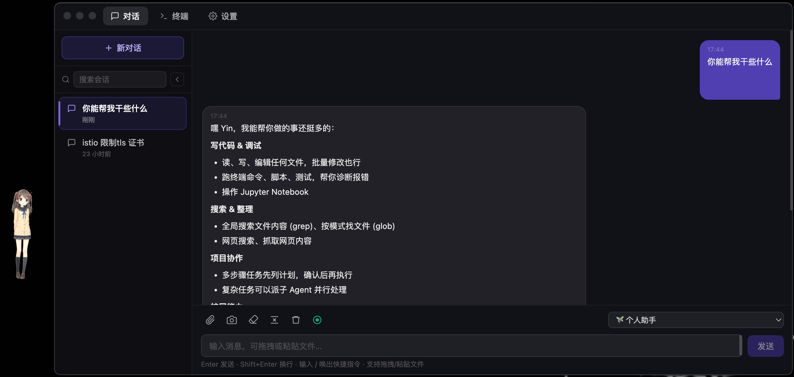

# DesktopFairy

常驻 macOS 桌面的 Live2D 看板娘，集成 AI 对话、智能体工具、终端与知识库。



聊天窗口顶部四个 Tab：**对话** / **终端** / **知识库** / **设置**（同时挂载，切换不丢状态）。

## 功能

### Live2D 桌面伙伴

- 透明悬浮窗，Live2D 角色始终显示在桌面最前方
- 鼠标跟随、动作、表情；**拟人化反应**（随聊天状态换表情，可在设置中关闭）
- 回复时可选 **台词气泡**（字数上限可调）
- 跨 Space 置顶，自定义拖动，强制置顶
- 全局快捷键显示 / 隐藏伴侣窗口（默认 `Command+R`，可在设置 → 快捷键修改）

### AI 对话

- OpenAI 兼容 / OpenAI Responses / Anthropic / Ollama 流式输出，可中断
- 多会话管理（侧边栏新建 / 切换 / 重命名 / 删除）
- 上下文管理：清除上下文、**AI 压缩上下文**（`/compact`）
- 附件：文本嵌入、图片 multimodal、拖拽 / 粘贴 / 截图
- 可勾选知识库：普通对话发送前预检索并注入上下文

### 智能体模式

- **SOUL.md** — 定义智能体的人格、用途与执行规则
- **USER.md** — 记录用户偏好与习惯，自动注入每次对话
- **UpdateProfile 工具** — 智能体在对话中自动学习并更新 USER.md
- **Skills 系统** — 可安装 / 启用技能扩展能力（内置 find-skills、skill-creator）
- **MCP 服务器** — 接入外部工具服务
- **内置工具** — Read / Write / Edit / Bash / Terminal / Glob / Grep / WebSearch / WebFetch / TodoWrite / Skills / AskUserQuestion / kb_search / kb_read
- **对话模式** — 普通 / 计划（只读）/ 自动编辑（文件免确认）/ 全自动（全部免确认）

### 终端

- 内置终端（xterm + 本机 PTY），多标签
- SSH 连接：保存主机、快速连接 `user@host`
- 侧栏智能体可在当前会话执行命令、读写文件，并与对话共用同一套工具与知识库

### 知识库

- 多个知识库；库内可添加文件或 Markdown 笔记
- 支持 `.txt` / `.md` / `.docx`；PDF 需配置文档处理器（MinerU 官方 API 或自托管 Open MinerU）
- 全局 embedding 与分块 / 召回参数（所有库共用）
- 向量检索；智能体通过 `kb_search` / `kb_read` 引用原文；对话可多选库预检索
- 库内召回测试：查看分块与匹配度

### 快捷指令

- 输入 `/` 唤出快捷指令面板
- `/clear` — 清除上下文，后续消息不再引用此前对话
- `/compact` — AI 自动压缩上下文摘要并清除旧对话
- `/<skill-id>` — 指定使用特定技能

### 其他

- 接入云端或本地：OpenAI / Anthropic / Ollama / vLLM / LM Studio / Hermes Agent 等
- 系统托盘，菜单栏快捷操作
- 划词助手（快捷键 / 自动弹出）
- 区域截图（macOS `screencapture`）；托盘「截图复制」走系统 OCR
- 应用内浏览器：对话中的链接在独立窗口打开
- 全局快捷键可配置（伴侣窗口、划词触发）
- Cmd+W 关闭窗口

## Hermes Agent 快速接入

DesktopFairy 内置 Hermes 系统 Provider（设置 → AI 模型 → 启用 **Hermes Agent**）：

1. 在 Hermes 项目中启用 API Server（例如 `API_SERVER_ENABLED=true`）并启动 gateway（默认 `http://127.0.0.1:8642/v1`）
2. 在 DesktopFairy 设置中将 Hermes 的 **API Key** 填为 Hermes 的 `API_SERVER_KEY`
3. 选择模型 **hermes-agent**，即可流式对话；tools/skills 在 Hermes 服务端执行

## Live2D 模型

- **内置模型**：仅包含 Live2D SDK 官方示例 **Hiyori**（无版权问题）
- **其他模型**：请自行下载后，在设置 → Live2D →「浏览本地目录…」加载（需遵守相应授权）

## 安装

> 仅支持 Apple Silicon（M1/M2/M3/M4 系列）。Intel Mac 暂不支持。

### Homebrew（推荐）

Cask 发布在私有 tap [`meimeitou/homebrew-tap`](https://github.com/meimeitou/homebrew-tap)，需要对该仓库有访问权限（本机 GitHub 已登录，或已配置 SSH key / token）。

```bash
brew tap meimeitou/tap
brew install --cask desktopfairy
```

若 `brew tap` 因私有仓库鉴权失败，可显式用 SSH：

```bash
brew tap meimeitou/tap git@github.com:meimeitou/homebrew-tap.git
brew install --cask desktopfairy
```

升级：

```bash
brew update
brew upgrade --cask desktopfairy
```

### 手动安装

前往 [GitHub Releases](https://github.com/meimeitou/DesktopFairy/releases) 下载最新版 `DesktopFairy-x.x.x-arm64.dmg`，双击挂载后将 `DesktopFairy` 拖入 `Applications`。

### 首次打开（Gatekeeper）

本项目为开源软件，构建为 ad-hoc 签名（无 Apple Developer 证书）。首次打开可能被 macOS 拦截，提示「无法打开，因为无法验证开发者」或「已损坏」。任选一种方式处理：

- **方式一（推荐，图形界面）**：在 Finder 的「应用程序」中右键点击 `DesktopFairy` → 选择「打开」→ 在弹窗中点击「仍要打开」
- **方式二（终端）**：
  ```bash
  sudo xattr -dr com.apple.quarantine /Applications/DesktopFairy.app
  ```

处理一次后，后续打开不再提示。

## 开发

需要 Node.js >= 18。架构说明见 [docs/arch.md](docs/arch.md)。

```bash
npm install
make dev             # 启动开发环境（Vite HMR + Electron，默认开启 DevTools）
make dev DEVTOOLS=0  # 不开启 DevTools
make lint            # ESLint
npm test             # Vitest 单元测试
```

开发时 Electron 主进程（`electron/*.cjs`）改动会自动 `relaunch`；可用 `ELECTRON_HOT_RELOAD=0 make dev` 关闭。Vite HMR 仅作用于渲染端（`src/`）。

## 打包

```bash
npm run build        # 生成 dmg 安装包（release/ 目录）
npm run build:dir    # 只打包目录，不出安装包（调试用）
make build-adhoc     # 无需 Apple Developer 账户的 ad-hoc DMG
```

## 技术栈

- **Electron** — 桌面壳（主进程 CJS，渲染端 ESM）
- **React 19 + TypeScript** — UI
- **Live2D Cubism SDK** — 角色渲染（WebGL2）
- **Vercel AI SDK** — 智能体多轮工具循环（`ToolLoopAgent`）
- **xterm.js + node-pty** — 终端；**ssh2** — SSH
- **better-sqlite3 + sqlite-vec** — 知识库向量检索
- **Vite** — 前端构建
